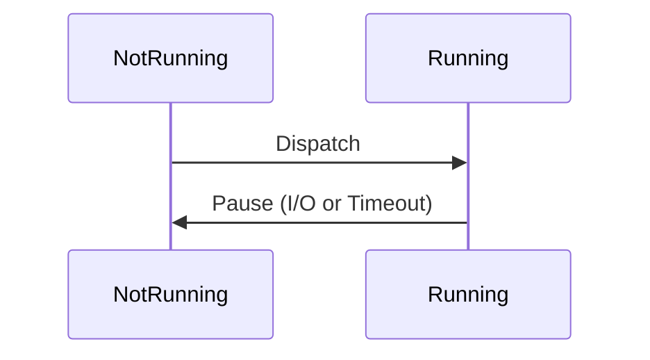
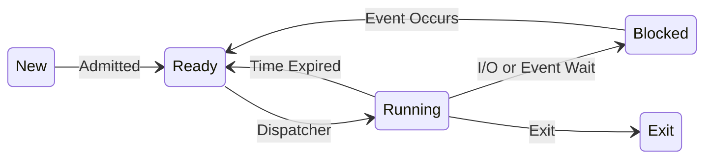

# 프로세스

## 프로세스란
실행중인 프로그램 단위
### 프로세스의 주요 요소
- 프로그램 코드
- 코드와  관련된 데이터
### 프로세스 식별
1. 프로세스 식별자 (Identifier)
2. 프로세스 상태 (State)
3. 프로세스 우선순위 (Priority)
4. 프로그램 카운트 (Program Counter)
5. Memory pointers
6. Context Data: 프로세스에 있는 레지스터의 값
7. I/O Status information: 프로세스에 할당된 I/O
8. Accounting information: 프로세스에 할당된 CPU등..

### Process Control Block
프로세스 요소 포함, OS에 의해 관리 및 생성, 프로세스 전환을 가능하게 함. 다중 프로세스에 중요.
- Trace: 프로세스 내에서 실행된 명령어들의 목록
- Dispatcher: 프로세스간에 스위칭 해주는 프로그램, 프로세스 Interleaving 지원
1. Process Identifier: Parent processor, User identifier, Identifier of this processor
2. Processor State Information: User visible register, Control and Status Register
3. Stack Pointers
4. Process Control Information: 
- User mode
- System mode (kernel mode): Privileged mode
### Two-State Process Model


실행되지 않는 프로세스는 큐에서 대기, 큐는 각각의 PCB의 포인터 저장
5. 프로세스 생성: Process Spawning
	- Parent process
	- Child process
6. 프로세스 종료

### Five-State Process Model

 ```mermaid
 flowchart LR
 ReadyQueue --Dispatch--- Processor --Wait--- Event1Queue & Event2Queue --EventOccure--- ReadyQueue
 Processor --> Release
```
- **Swapping**: 메인 메모리의 프로세스의 일부 혹은 전체를 디스크로 이동
	- Suspended Process: 디스크로 이동한 프로세스
	- Pause Process: 메인 메모리에 있는 일시정지된 프로세스
	- Seven-State Process Model
	```mermaid
	stateDiagram
    [*] --> New
    New --> Ready : Admit
    New --> ReadySuspend: Admit
    Ready --> Running : Dispatch
    Running --> Ready : TimeOut
    Running --> Blocked : Event wait
    Blocked --> Ready : Event occurs
    Blocked --> BlockedSuspend : Suspend
    BlockedSuspend --> Blocked : Active
    Ready --> ReadySuspend : Suspend
    ReadySuspend --> Ready : Activate
    BlockedSuspend --> ReadySuspend : Event occurs
    Running --> Exit : Release
	```


### Process Description
Memory Table
File Table
Primary Process Table: 프로세스 이미지 포인터 저장
7. Process Image 
	- User Data
	- User Program
	- Stack
	- **Process Control Block**
Process Creation
1. 프로세스에 unique PID 할당
2. 프로세스 공간 할당
3. PCB 초기화
4. 적절한 연결 설정
5. 데이터 구조 생성 및 확장
System Interrupt: 현재 실행중인 명령어 외부에서 발생, 비동기적 외부 이벤트
	- Clock Interrupt
	- I/O Interrupt
	- Memory fault
	- **모드 스위칭**: 인터럽트 발생시 -> ProgramCounter를 인터럽트 핸들러의 주소로 설정 -> User에서 Kernel모드로 변경 (Privileged instructions에 대한 명령어 실행을 위해)
Trap: 현재 실행중인 명령어에서 생성, 에러 혹은 예외 핸들링
	- Error or Exception
Supervisor call: 명시적으로 요청

Process Switching: 
1. Context 저장
2. 현재 실행중인 프로세스의 PCB 업데이트, 큐에 적재
3. 다음 프로세스 선택, 선택된 프로세스의 PCB 업데이트
4. 메모리 관리 데이터 업데이트
5. 새로운 프로세스 시작시 Context 복구
